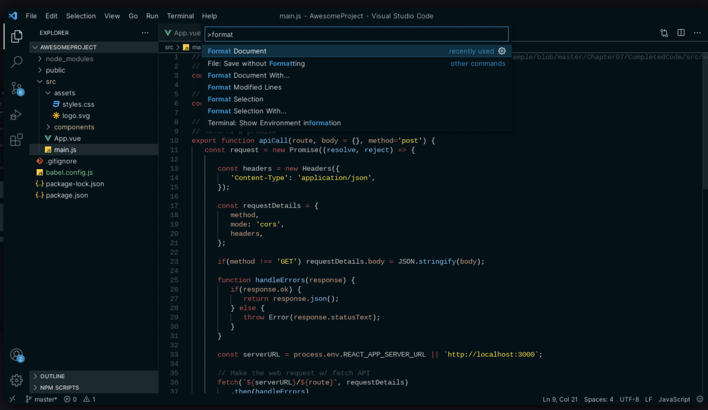
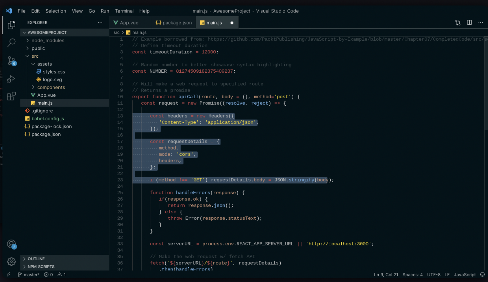
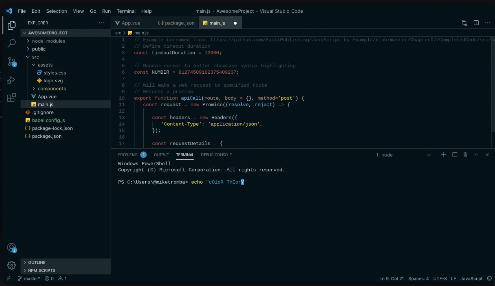
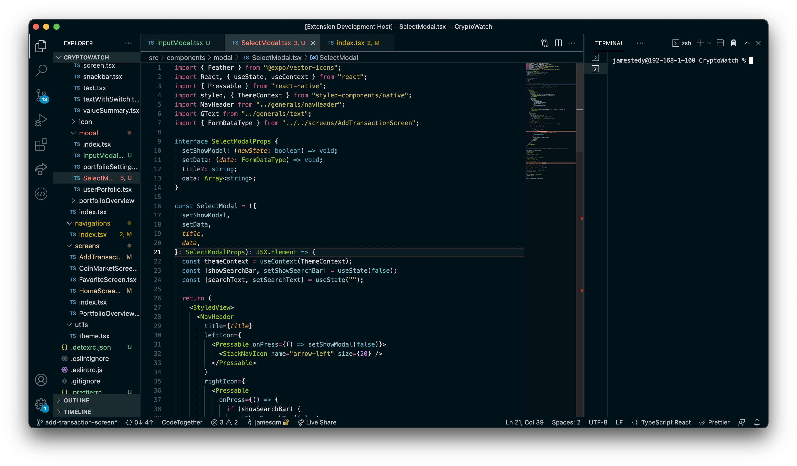

# Dark Theme Collection README

Collection of Dark Themes made by me.

## Installation

- Press `ctrl/command + p` to launch the command palette, then run:

  `ext install jamestedy.dark-theme-first`

- OR Run this command in the terminal:

  `code --install-extension jamestedy.dark-theme-first`

- OR go to Extensions in Visual Studio Code then search for `jamestedy.dark-theme-first` and click `install`

## Themes

### Dark Swamp

This theme is made in [this website](https://themes.vscode.one/theme/jmstdy/DILJLuBt)

### Dark Swamp Plus

This theme is based on Dark Swamp, but with different syntax color and made with React Native development experience in mind.

